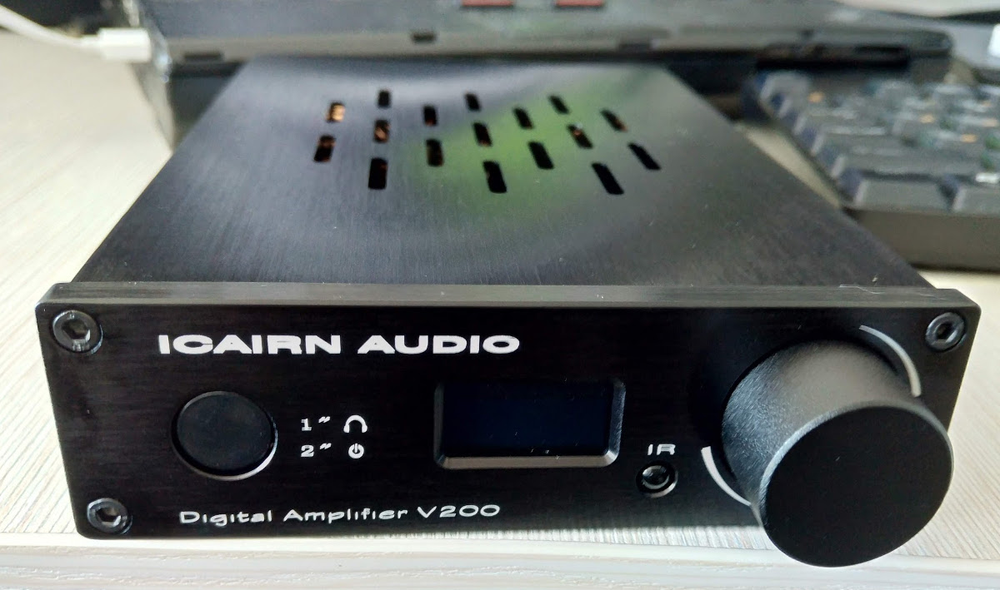
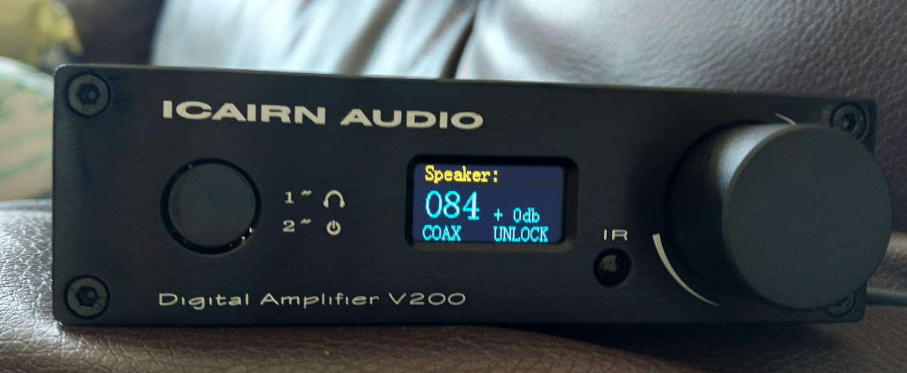

# Радио для усилителя I.AM.D v200
_____

## Оглавление
0. [Запуск](#Запуск)
1. [Зачем?](#Зачем?)
2. [Внешний вид](#Внешний-вид)
3. [API усилителя](#API-усилителя)
4. [Особенности проекта](#Особенности-проекта)
5. [Видео работы приложения](#Видео-работы-приложения)

## Запуск
Перед запуском проекта установите необходимые зависимости 
```bash
  pip install -r requirements.txt
```
Проект гарантированно работает в Python 3.8 и выше, вероятно в 3.7.x тоже заработает. 

- Для запуска проекта запустите `main.py` из корня
- В директории `resource` находятся необходимые ресурсы проекта 
- В директории `docs` находятся некоторые справочные материалы проекта
- В файле `conf.ini` настройки подключения к усилителю
- В файле `iamd.py` функции взаимодействия с усилителем
- В файлах `form_add.*` и `main_wnd.*` находится UI


## Зачем?
Купив усилитель I.AM.D v200 у братьев китайцев (https://www.aliexpress.com/item/32417096558.html), и обнаружил в нем API которое позволяет играть стримы с интернета.
Ни одного внятного ПО заточенного под эту задачу не существует. Есть какой то софт для DLNA и UnPnP но только на мобильные устройсва.
Вся прелесть в том, что если отдать url стрима радио потока по API, то радио будет играть независимо от ПК т.е. после этого ПК можно выключать.

Но есть и недостаток, из-за схемотехники прохождение "цифры" между модулем wifi и оконечным усилителем проходит мимо DSP и это не дает взоможности регулировать громксть через API, хотя такая возможность есть и усилитель в статусе громкость меняет, но фактически громкость управляется только с пульта или энкодера на лицевой панели.
Внутри усилителя есть урезанный linux и наверное, следующим этапом, я чуть поправлю его API, но это уже сильно выходит за рамки проекта PyQT.

Так как этот усилитель достаточно редкий и проверить проект захочется в живую, в нем реализована возможность проигрывать радио локально через устройство воспроизведения по умолчанию.
Так как я заклятый "linuxоид" то собрать готовый пакет по widows не смогу из-за отсутствия оной, а бинарник linux мало кому нужен. 
____
[:arrow_up:Оглавление](#Оглавление)

## Внешний вид


____
[:arrow_up:Оглавление](#Оглавление)

## API усилителя
Его можно посмотреть в docs/20160516-manuel-api-sonoe-ieast.pdf. И да, оно существует только на французком языке.
Есть один англоязычный ресурс где разбирались с этим усилителем: https://www.diyaudio.com/forums/class-d/302748-am-v200-wifi.html#post4964189

Пример команды которая позволяет проиграть поток 
```
http://192.168.1.182/httpapi.asp?command=setPlayerCmd:play:http://nashe1.hostingradio.ru/nashe-256
```
Весь список команд приведет в API, но реально нужно play, stop, get_player_status. Остальные могут понадобиться для проигрывания материалов например через DLNA.
____
[:arrow_up:Оглавление](#Оглавление)

## Особенности проекта

* Проект написан на PyQT5 с использованием языка Python 3.8 и выше
  
* В качестве локального плеера используется библиотека python-vlc https://wiki.videolan.org/Python_bindings/

* Конфиг усилителя вынесен в `conf.ini` для того чтобы показать работу с подобными файлами и библиотекой configparser

* Если конфиг `conf.ini` не найден или он некорректный то он будет пересоздан

* Работа с API усилителя вынесена в отдельный файл `iamd.py`

* Так как в теме PyQT мы показываем работу с БД в качестве источника хранения плейлистов используется БД, хотя это и выглядит нелогичным и лишним
  
* Стандартная библиотека sqlite3 не используется, а используется pysqlite3-binary, так как в последней возможно UPSERT (sqlite3 это тоже возможно, но только в версиях выше 3.24.0, в тех версиях Python что я пробовал, этой версии еще нет)
со старой библиотекой не проходит sql `ON CONFLICT() DO`
  ```sqlite
  INSERT INTO playlist (name, bitrate, status, url)
  VALUES ('Наше Радио', 256, 1, 'http://nashe1.hostingradio.ru/nashe-256') 
  ON CONFLICT(name) DO 
  UPDATE SET name='Наше Радио', bitrate=256, url='http://nashe1.hostingradio.ru/nashe-256}' 
  WHERE name = 'Наше Радио';

* БД при запуске проверяется, и если её нет или она по какой-то причине не возвращает адекватынй результат (испорчена) она будет создана с нуля по файлу `resource/db_blank.sql`
  
* Для хоть какого то усложнения БД, хранение иконок радиостанций сделано в отдельной таблице

* Воспроизведение начинается после двойного клика по плейлисту, после клика по кнопке 'PLAY', переключение возможно по двойному клику по строке плейлиста или нажатием кнопок 'NEXT' и 'PREV'

* Кнопки UI загружаются из resource/

* Редактор плейлиста вынесен в отдельный виджет, который связан сигналами с основным окном

* Плейлист можно редактировать изменяя поля непосредственно в таблице, или введя данные в советующие поля. Критерий уникальности это имя радиостанции.

* При запуске плеер пытается прочитать статус усилителя, и если он доступен то статус будет отображен в статус баре основного окна.
Если он воспроизводит в это время поток,то счетчик времени будет взят с усилителя, иначе, при проигрывании локально счетчик будет с локального плеера
  Чтобы не нагружать лишними запросами усилитель, его статус обновляется только при проигрывании на нем радио раз в 10 секунд.
  
  
* Регулировка громкости возможна, только когда играет локальное радио (причины описаны выше)
____
[:arrow_up:Оглавление](#Оглавление)

## Видео работы приложения

[](https://youtu.be/nIcF7Em2hGw)
____
[:arrow_up:Оглавление](#Оглавление)
